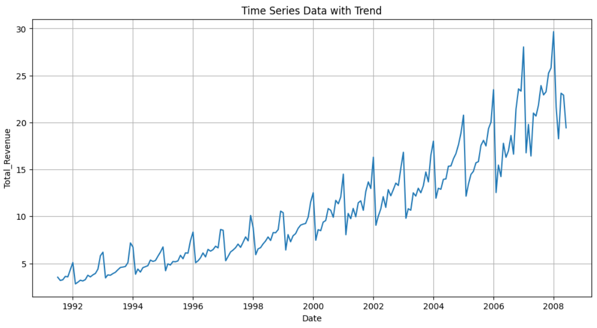

# 📈 Timeseries Modelling - Auto ARIMA
**Timeseries Modelling | Machine Learning Bootcamp - Dibimbing.id**

**Author:** Lhedya Monica Ismon

---

## 🎯 Objective
Melakukan analisis dan pemodelan data timeseries menggunakan 
Auto ARIMA untuk memprediksi tren ke depan, dengan terlebih 
dahulu menganalisis trend, seasonality, decomposition, 
dan stationarity data.

---

## 🗃️ Dataset
| Info | Detail |
|------|--------|
| Source | Library Darts (built-in dataset) |
| Tipe Data | Time Series |
| Tools | Google Colab, Python |

---

## 📋 Analysis Steps

### 1️⃣ EDA - Trend & Seasonality
- Pengecekan visual trend data dari waktu ke waktu
- Identifikasi pola seasonality (musiman)
- Decomposition data timeseries (Trend + Seasonal + Residual)

### 2️⃣ Stationarity Check - ADF Test
- Augmented Dickey-Fuller (ADF) Test
- Menentukan apakah data bersifat **Additive** atau **Multiplicative**
- Transformation method jika data tidak stasioner

### 3️⃣ Auto ARIMA Modelling
- Training model Auto ARIMA
- Prediksi data future
- Evaluasi model dengan metrik MAE, RMSE, MAPE

---

## 📊 Hasil Analisis

### Trend & Seasonality
| Komponen | Hasil Interpretasi |
|----------|-------------------|
| Trend | ... (isi sesuai hasil) |
| Seasonality | ... (isi sesuai hasil) |
| Decomposition | Additive / Multiplicative |

### ADF Test Result
| Parameter | Nilai |
|-----------|-------|
| ADF Statistic | ... |
| p-value | ... |
| Kesimpulan | Stationary / Non-Stationary |
| Tipe Data | Additive / Multiplicative |
| Transformation | Differencing / Log Transform / dll |

### Model Evaluation
| Model | MAE | RMSE | MAPE |
|-------|-----|------|------|
| Auto ARIMA | ... | ... | ... |

---

## 📸 Visualisasi

### Trend & Seasonality


---

## 🔧 Tools & Libraries
```python
# Libraries yang digunakan
import pandas as pd
import numpy as np
import matplotlib.pyplot as plt
import seaborn as sns
from darts import TimeSeries
from darts.models import AutoARIMA
from statsmodels.tsa.stattools import adfuller
from statsmodels.tsa.seasonal import seasonal_decompose
```

---

## 📁 File Structure
- `notebook/` → Google Colab (.ipynb)
- `screenshots/` → Visualisasi hasil analisis
- `portfolio/` → Dokumentasi lengkap

## 💡 Kesimpulan

### 📊 Karakteristik Data
| Komponen | Hasil |
|----------|-------|
| **Trend** | Tren naik positif konsisten dari 1991–2008 |
| **Seasonality** | Pola musiman 12 bulan — puncak akhir tahun, lembah awal tahun |
| **Decomposition** | **Multiplicative** — amplitudo musiman meningkat seiring tren |
| **ACF/PACF** | Puncak signifikan di lag 12, 24, 36 → periode musiman = 12 bulan |

---

### 🔬 ADF Test - Stationarity Check
| Kondisi | ADF Statistic | p-value | Kesimpulan |
|---------|--------------|---------|------------|
| Sebelum Transformasi | Sangat tinggi | 1.0 (> 0.05) | ❌ Tidak Stasioner |
| Setelah Transformasi | Negatif (kecil) | < 0.05 | ✅ Stasioner |

**Transformation Method yang digunakan:**
1. **Log Transformation** → menstabilkan varians yang terus membesar
2. **Differencing** → menghilangkan tren naik jangka panjang

---

### 🤖 Model Auto ARIMA
- **Tipe Model:** SARIMA (Seasonal ARIMA) via pmdarima
- **Periode Musiman:** m = 12 bulan
- **Train/Test Split:** 80% train / 20% test
- **Parameter Search:** stepwise=True, max n_fits=50

### 📈 Evaluasi Model
| Metrik | Train | Test | Interpretasi |
|--------|-------|------|-------------|
| **MAE** | 0.054 | 0.097 | Kesalahan rata-rata sangat kecil |
| **MSE** | 0.0098 | 0.0126 | Error besar jarang terjadi |
| **MAPE** | 1.37% | 1.93% | Model meleset hanya ~1.93% ✅ |

> **Kesimpulan Model:** Auto ARIMA adalah model terbaik untuk dataset ini
> karena berhasil menangkap tren naik jangka panjang dan pola musiman 
> 12 bulan dengan MAPE test hanya **1.93%** — tidak terjadi overfitting 
> karena performa train dan test sangat konsisten.

---

### 📅 Future Prediction: 24 Bulan ke Depan
- **Tren:** Nilai penjualan diperkirakan terus meningkat
- **Musiman:** Pola puncak akhir tahun & lembah awal tahun tetap terjaga
- **Amplitudo:** Fluktuasi musiman makin besar seiring tren (sesuai sifat multiplicative)
- **Output:** Tersimpan di `future_predictions.xlsx` & model di `full_arima_model.pkl`

---

### ✅ Kelebihan Model
- MAPE test 1.93% — akurasi sangat tinggi untuk data timeseries nyata
- Tidak overfitting — performa train dan test konsisten
- Auto ARIMA berhasil menangkap komponen musiman 12 bulan secara otomatis
- Pipeline transformasi (log + diff) berhasil mengubah data non-stasioner
- Model tersimpan sebagai `.pkl` — siap dipakai tanpa melatih ulang


---

### 💼 Business Impact
| Area | Manfaat |
|------|---------|
| **Manajemen Stok** | Antisipasi stok sesuai prediksi musiman |
| **Perencanaan Produksi** | Jadwal kapasitas lebih efisien 24 bulan ke depan |
| **Strategi Promosi** | Kampanye tepat waktu menjelang puncak musiman |
| **Perencanaan Anggaran** | Proyeksi revenue lebih akurat untuk target bisnis |